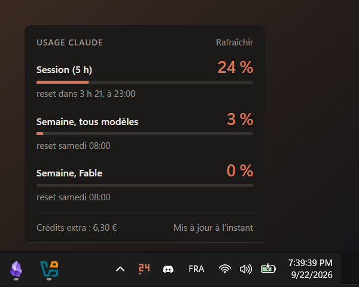
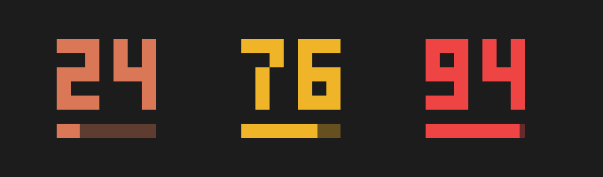
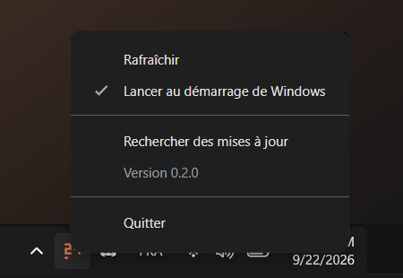

<div align="center">


# Claude Usage

**Ton usage Claude, toujours sous les yeux. Un coup d'œil à la barre des tâches, et tu sais où tu en es.**

[](../../releases/latest)
[](../../releases/latest)

<br />



</div>

<br />

Fini de taper `/usage` dans un terminal pour savoir s'il te reste de la marge. Claude Usage pose une petite icône à côté de l'horloge : elle affiche en direct le pourcentage de ta session, et un clic suffit pour voir tout le détail. 👀

## ✨ Ce que tu vois

- 🔢 **Ta session en direct** : le pourcentage de ta session de 5 h s'affiche directement dans l'icône, avec une petite barre qui se remplit.
- 📅 **Ta semaine** : ta limite hebdomadaire, et celle de chaque modèle quand ton abonnement en a une.
- ⏰ **L'heure du reset** : « reset dans 3 h 21, à 23:00 », pour savoir exactement quand tu repars à zéro.
- 💶 **Tes crédits extra** : ce que tu as dépensé au-delà de ton forfait.
- 💬 **Au survol** : tous les chiffres dans une infobulle, sans même cliquer.

## 🚦 L'icône change de couleur

<div align="center">

</div>

<div align="center">

| 🟠 Tranquille |   🟡 Attention   | 🔴 Presque au bout |
| :-----------: | :--------------: | :----------------: |
| moins de 70 % | à partir de 70 % |  à partir de 90 %  |

</div>

Pas besoin de lire le chiffre : la couleur te dit déjà s'il faut lever le pied.

## 🌗 Clair ou sombre, il suit ton Windows

<div align="center">

&nbsp;&nbsp;

</div>

## 🖱️ Tout le reste au clic droit

<div align="center">

</div>

Rafraîchir à la demande, activer ou couper le lancement au démarrage, chercher une mise à jour, voir ta version.

## 📥 Installer en 3 étapes

1. **Télécharge** `claude-usage-setup-x.x.x.exe` sur la [page des versions](../../releases/latest).
2. **Lance-le.** Pas besoin de droits administrateur, l'installation prend quelques secondes.
3. **Épingle l'icône** : Windows 11 cache les nouvelles icônes derrière la petite flèche `^` à côté de l'horloge. Glisse-la dans la barre des tâches pour l'avoir toujours visible.

Et c'est tout. L'app démarre toute seule avec Windows. 🎉

> 💡 **Il te faut** Claude Code, connecté avec ton abonnement Claude. Si ce n'est pas encore fait : ouvre un terminal, tape `claude`, puis `/login`.

> 🛡️ Au premier lancement, Windows peut afficher « Windows a protégé votre ordinateur ». C'est normal pour une petite app pas encore connue de Microsoft : clique sur **Informations complémentaires**, puis **Exécuter quand même**.

## 🔄 Toujours à jour, sans rien faire

L'app vérifie elle-même s'il existe une nouvelle version, la télécharge en arrière-plan, puis te prévient par une notification. Un clic pour redémarrer, et c'est installé. Si tu ignores la notification, la mise à jour s'installe à la prochaine fermeture.

## 🔒 Tes données restent chez toi

- L'app lit la connexion que Claude Code a déjà enregistrée sur ton PC. Tu n'as rien à saisir.
- Elle demande tes chiffres directement à Anthropic, exactement comme la commande `/usage`.
- Rien n'est envoyé ailleurs, rien n'est collecté.
- Chaque personne qui l'installe voit **son propre** usage, jamais celui de quelqu'un d'autre.

## ❓ Un petit souci ?

<details>
<summary><b>« Token expiré » ou « Token refusé »</b></summary>
<br />
Ta connexion Claude Code a besoin d'être rafraîchie. Ouvre Claude Code une fois, puis clique sur <b>Rafraîchir</b> dans le panneau.
</details>

<details>
<summary><b>« Identifiants Claude Code introuvables »</b></summary>
<br />
Claude Code n'est pas connecté sur cette session Windows. Ouvre un terminal, tape <code>claude</code>, puis <code>/login</code>.
</details>

<details>
<summary><b>« Trop de requêtes »</b></summary>
<br />
Le serveur demande de patienter un peu. Les chiffres reviennent tout seuls quelques minutes plus tard.
</details>

<details>
<summary><b>Je ne vois pas l'icône</b></summary>
<br />
Elle est sûrement cachée derrière la petite flèche <code>^</code> à côté de l'horloge. Glisse-la dans la barre des tâches.
</details>

---

<details>
<summary>🛠️ <b>Pour les développeurs</b></summary>

<br />

Electron, electron-vite et TypeScript strict. Il faut Node 24+ et pnpm 10+.

```bash
pnpm install
pnpm dev          # lance l'app en mode développement
pnpm typecheck
pnpm lint
pnpm build:win    # génère l'installeur dans dist/
```

**Publier une version** : monter `version` dans `package.json`, lancer `pnpm build:win`, puis joindre à une release GitHub les trois fichiers de `dist/` : l'installeur `.exe`, son `.blockmap` et `latest.yml`. Sans ces trois fichiers, la mise à jour automatique ne voit pas la nouvelle version.

**L'icône** est dessinée dans `resources/icon.svg`. Après une modification, `pnpm icon` régénère `resources/icon.ico`.

| Dossier              | Rôle                                                                           |
| -------------------- | ------------------------------------------------------------------------------ |
| `src/main`           | lecture de la connexion, appel à l'API, icône dynamique, panneau, mises à jour |
| `src/preload`        | pont entre l'app et le panneau                                                 |
| `src/renderer/panel` | interface du panneau                                                           |
| `src/shared`         | types et seuils de couleur partagés                                            |
| `scripts`            | génération de l'icône `.ico`                                                   |

</details>
