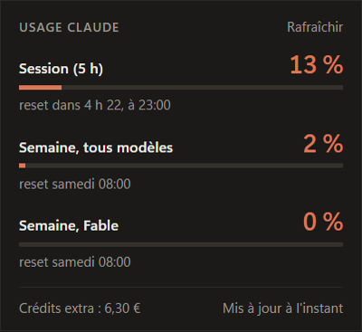
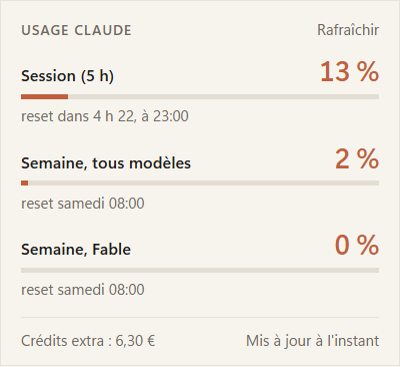

<div align="center">


# Claude Usage

**Ton usage Claude en un coup d'œil, depuis la barre des tâches Windows.**

</div>

Plus besoin d'ouvrir un terminal et de taper `/usage` dans Claude Code. L'icône affiche en permanence le pourcentage de ta session en cours, un clic ouvre le détail.

<div align="center">

</div>

## Ce que ça affiche

<div align="center">

&nbsp;

</div>

- **Dans l'icône** : le % de la session de 5 h, avec une barre de remplissage. Orange en temps normal, jaune à partir de 70 %, rouge à partir de 90 %.
- **Au survol** : tous les pourcentages dans l'infobulle.
- **Au clic** : un panneau avec la session, la limite hebdomadaire, les limites par modèle quand ton plan en a, l'heure de chaque reset et les crédits extra consommés. Il suit le thème clair ou sombre de Windows.
- **Au clic droit** : Rafraîchir, Lancer au démarrage de Windows, Quitter.

Les chiffres se mettent à jour toutes les 2 minutes, à l'ouverture du panneau et à la sortie de veille.

## Installer

1. Télécharger `Claude.Usage.Setup.x.x.x.exe` depuis la [page Releases](../../releases/latest) et le lancer. L'installation se fait sans droits administrateur.
2. L'app démarre dans la zone de notification et s'ajoute au démarrage de Windows.
3. Windows 11 range les nouvelles icônes dans le menu caché (la flèche `^`). Glisser l'icône dans la barre des tâches pour l'avoir toujours sous les yeux.

Prérequis : être connecté à Claude Code avec un abonnement Claude, via `claude` puis `/login`.

## Comment ça marche

L'app lit le token OAuth que Claude Code enregistre dans `%USERPROFILE%\.claude\.credentials.json` (ou dans `CLAUDE_CONFIG_DIR` si cette variable est définie), puis interroge le même endpoint que la commande `/usage`. Rien n'est stocké ni envoyé ailleurs.

Le token n'est jamais renouvelé par l'app : le faire changerait les identifiants de Claude Code et risquerait de le déconnecter. Si le token a expiré, le panneau l'indique. Lancer Claude Code une fois suffit à le rafraîchir.

## Dépannage

- **« Token expiré » ou « Token refusé »** : ouvrir Claude Code une fois, puis cliquer sur Rafraîchir.
- **« Identifiants Claude Code introuvables »** : Claude Code n'est pas connecté sur ce compte Windows. Lancer `claude` puis `/login`.
- **« Trop de requêtes »** : le serveur limite les appels. Les chiffres reviennent seuls au cycle suivant.
- **L'icône n'apparaît pas** : elle est probablement dans le menu caché `^` de la barre des tâches.

## Développement

<details>
<summary>Compiler depuis les sources</summary>

Prérequis : Windows, Node 24+, pnpm 10+.

```bash
pnpm install
pnpm dev          # lance l'app en mode développement
pnpm typecheck
pnpm lint
pnpm build:win    # génère l'installeur dans dist/
```

L'icône de l'exe est dessinée dans `resources/icon.svg`. Après une modification, `pnpm icon` régénère `resources/icon.ico`.

Stack : Electron, electron-vite, TypeScript strict.

| Dossier              | Rôle                                                                                 |
| -------------------- | ------------------------------------------------------------------------------------ |
| `src/main`           | process principal : lecture du token, appel API, icône dynamique, fenêtre du panneau |
| `src/preload`        | pont IPC exposé au panneau                                                           |
| `src/renderer/panel` | interface du panneau                                                                 |
| `src/shared`         | types et seuils partagés                                                             |
| `scripts`            | génération de l'icône `.ico`                                                         |

</details>
